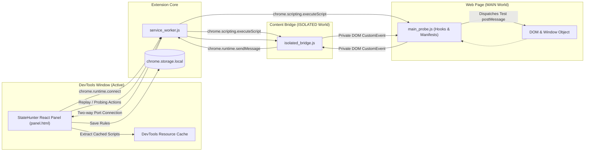

# StateHunter: In-Browser SPA State & DOM Security Recon

[](https://codeandcypher.com)
[](https://developer.chrome.com/docs/extensions/mv3/intro/)
[](tests/)
[](tsconfig.json)
[](package.json)
[](tailwind.config.js)
[](LICENSE)
[](docs/rfcs/RFC-001-COMMUNITY-PEER-REVIEW.md)

A high-performance **Chrome Manifest V3 DevTools Extension** designed for application security engineers, penetration testers, and bug bounty hunters. Authored by **Joshua A. Wortz, CISSP** ([Code & Cypher](https://codeandcypher.com)).

> 📢 **Call for Peer Review**: We have published **[RFC-001: Community Peer Review](docs/rfcs/RFC-001-COMMUNITY-PEER-REVIEW.md)** and the companion technical paper **[Bridging the Browser-to-Boundary Gap](https://codeandcypher.com/posts/client-side-spa-recon-and-safe-harbor-verification/)**. We invite AppSec engineers, penetration testers, and bug bounty researchers to test our de-obfuscation heuristics and share feedback in [GitHub Discussions](https://github.com/SixFiveMil/statehunter/discussions) or [Issues](https://github.com/SixFiveMil/statehunter/issues).

StateHunter performs real-time client-side runtime JavaScript analysis, detects sensitive data exposure in client storage, audits and replays `postMessage` handlers, de-obfuscates hidden Single Page Application (SPA) routes, harvests RFC 9116 vulnerability disclosure policies, enforces strict client-side scope boundaries during active testing, and exports triage-ready reports directly into Markdown or [AuditGuard](https://github.com/SixFiveMil/auditguard) format.

---

## 🌟 Key Capabilities

### 1. SPA Route Manifest De-Obfuscator & Live Reachability Prober
* **Manifest Parsing:** Parses Next.js (`__BUILD_MANIFEST`, `__SSG_MANIFEST`), Nuxt, Remix, and Webpack chunk manifests to uncover unlinked admin/internal endpoints (e.g. `/admin/dashboard`, `/internal/feature-flags`, `/api/v2/private`).
* **Live Route Status Prober (Active):** Asynchronously checks HTTP status codes (`200 OK`, `401 Unauthorized`, `403 Forbidden`, `404 Not Found`) with concurrency limiting (max 3 workers) and millisecond latency tracking.
* **Scope Guardrail Enforcement:** Mathematically blocks network requests to excluded paths (`/logout`, `/delete`, `/billing`, or custom exclusions) and out-of-scope targets before `fetch()` is dispatched, labeling them `🛡️ BLOCKED (Scope)`.
* **Smart Route Categorization:** Automatically flags routes into `admin`, `api`, `dynamic`, and `standard`.

### 2. `postMessage` Security Auditor & Interactive Replay Console
* **Listener Auditing:** Hooks `window.addEventListener('message')` in the native `MAIN` world to audit handler source code for `event.origin` validation.
* **Dangerous Sink Correlation:** Detects untrusted cross-origin messages that feed directly into dangerous DOM sinks (`innerHTML`, `eval`, `location.href`).
* **Active Replayer & Dispatcher Console:** Edit captured JSON payloads or use pre-built presets (*Diagnostic Ping*, *HTML Sink Test*, *Auth Callback Mock*) to test event listeners live.
* **Wildcard Token Detection:** Flags outgoing messages dispatched with `targetOrigin: "*"` containing sensitive tokens.

### 3. In-Memory Secrets & Shannon Entropy Engine
* **Deep Memory Scanning:** Audits `window.*` globals, `__NEXT_DATA__` hydration props, `localStorage`, and `sessionStorage`.
* **Credential Pattern Matching:** Built-in regex detectors for AWS Access Keys, Google Cloud/Firebase API keys, Stripe secret/restricted keys, and Slack Webhooks.
* **JWT Claim Inspector:** Automatically decodes JSON Web Tokens, flagging token expiration and sensitive claims (`role: admin`, `email`, `ssn`).
* **Shannon Entropy Scoring:** Identifies unlabeled high-entropy API keys ($H \ge 4.6$ bits).

### 4. Dynamic Well-Known Recon & Configurable Scope Manager
* **Authorized In-Scope Targets:** Add authorized microservices, subdomains, and wildcard origins (e.g. `https://api.target.com`, `*.target.com`, `/api/v1/*`) derived from Rules of Engagement.
* **RFC 9116 `security.txt`:** Automatically extracts the target's official Safe Harbor policy link (`Policy`), security contacts (`Contact`), and Hall of Fame (`Acknowledgments`).
* **`robots.txt` Disallow Explorer:** Discovers and searches crawler-restricted directories with 1-click import directly into your excluded paths list to ensure off-limits targets are protected.
* **Precision Scope Enforcement (Literal vs. Wildcard):** Literal paths (e.g. `/billing`, `/logout`, `/delete`) strictly protect exact routes and direct subpaths. Arbitrary nested path segments require explicit wildcards (e.g. `*/billing/*`, `*delete*`), ensuring researchers can block specific literal endpoints without collateral over-blocking. Instant persistence via `chrome.storage.local`.

### 5. Triage-Ready Reporting & AuditGuard Bridge
* **Markdown Bug Bounty Report:** Generates formatted triage reports with executive summaries, risk matrices, and PoC reproductions.
* **AuditGuard Scope YAML:** Outputs structured definitions directly consumable by the [AuditGuard](https://github.com/SixFiveMil/auditguard) CLI (`config/programs.yaml`).

---

## 🏗️ Architecture & Execution Model

StateHunter is a pure **DevTools-Activated Extension** compliant with Chrome Web Store Developer Program Policies. When DevTools is closed, zero scripts are injected and zero background telemetry is gathered. When DevTools is opened, StateHunter dynamically injects probes into the inspected tab:



> For deep architectural details, see [**docs/ARCHITECTURE.md**](docs/ARCHITECTURE.md).

---

## 🚀 Quickstart & Installation

### 1. Build the Extension
```bash
# Clone the repo
git clone https://github.com/SixFiveMil/statehunter.git
cd statehunter

# Install dependencies & compile production bundle
npm install
npm run build
```
This compiles the unpacked extension into the `dist/` directory.

### 2. Load into Chrome or Brave
1. Open Chrome or Brave and navigate to `chrome://extensions/`.
2. Toggle **Developer mode** on (top-right corner).
3. Click **Load unpacked**.
4. Select the `dist` directory inside your cloned repository.
5. **StateHunter** is now active!

### 3. Run the Synthetic Lab Testbed
StateHunter includes a dedicated synthetic testbed with Next.js manifest leaks, vulnerable `postMessage` listeners, storage tokens, and RFC 9116 fixtures:

```bash
python -m http.server 8080 --directory lab
```
Then open in Chrome:
* **Test Portal:** [http://localhost:8080/](http://localhost:8080/)
* Press **`F12`** $\rightarrow$ Click the **StateHunter** tab.

---

## 📚 In-Depth Documentation

* [**Architecture & Execution Model**](docs/ARCHITECTURE.md): DevTools-activated execution model, dynamic injection, and secure inter-world channels.
* [**Chrome Web Store Submission Guide**](docs/CWS_SUBMISSION_GUIDE.md): Copy-paste permission justifications, single-purpose descriptions, and reviewer instructions for CWS publishing.
* [**Privacy Policy**](PRIVACY_POLICY.md): Official Chrome Web Store compliant privacy policy and data disclosures.
* [**Active Testing Suite Guide**](docs/ACTIVE_TESTING.md): How to use the interactive `postMessage` replayer and live route status prober.
* [**Scope & Well-Known Standards Guide**](docs/SCOPE_AND_RULES.md): RFC 9116 `security.txt`, `robots.txt` harvesting, and AuditGuard integration.
* [**Contributing Guide**](docs/CONTRIBUTING.md): Setting up local development, adding custom secret patterns, and testing.

---

## 🧪 Testing & Verification

StateHunter includes a comprehensive automated test suite powered by [Vitest](https://vitest.dev/):

```bash
npm test
```

```
 ✓ tests/wellknown_harvester.test.ts (4 tests)
 ✓ tests/postmessage_tracker.test.ts (9 tests)
 ✓ tests/secret_scanner.test.ts (7 tests)
 ✓ tests/route_prober.test.ts (7 tests)
 ✓ tests/route_extractor.test.ts (10 tests)
 ✓ tests/scope_enforcer.test.ts (14 tests)
 ✓ tests/components_render.test.tsx (6 tests)

Test Files  7 passed (7)
     Tests  57 passed (57)
```

---

## 🤝 AuditGuard Integration

StateHunter is designed as a companion to the [AuditGuard](https://github.com/SixFiveMil/auditguard) compliance framework. Click **"AuditGuard Scope"** on any page to export target definitions directly into `config/programs.yaml`:

```bash
# Verify permissions offline before sending requests
python main.py check https://example.com/api/v1/users

# Execute authorized probe with append-only ledger and body hashing
python main.py probe https://example.com/api/v1/users -r "Verifying public API response"
```

---

## 👨‍💻 Author & Research

StateHunter is authored and maintained by **Joshua A. Wortz, CISSP** at [Code & Cypher](https://codeandcypher.com) — practical research, offensive tooling, and compliance automation for modern web applications.

* Website & Research: [https://codeandcypher.com](https://codeandcypher.com)
* GitHub: [@SixFiveMil](https://github.com/SixFiveMil)

---

## 📄 License

StateHunter is licensed under the [MIT License](LICENSE).
