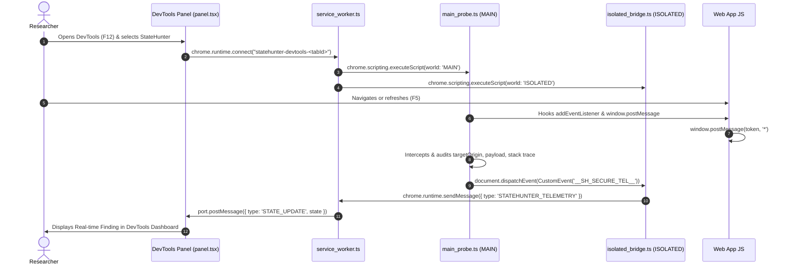

# StateHunter Architecture & Technical Design

This document provides a deep technical walkthrough of StateHunter's architecture, data flows, and Chrome Manifest V3 DevTools-only execution model.

---

## 1. High-Level System Architecture

StateHunter operates across four distinct execution contexts within the browser, activated **on-demand** when the developer tools panel is opened:

```mermaid
flowchart TB
    subgraph DevToolsContext ["Developer Tools Context (Active)"]
        DevToolsReg["DevTools Registrar (devtools.html)"]
        PanelUI["React UI Dashboard (panel.html / panel.tsx)"]
        ResScanner["Resource Cache Scanner (chrome.devtools.inspectedWindow)"]
    end

    subgraph ExtensionCore ["Extension Background"]
        SW["Background Service Worker (background.js)"]
        Badge["Extension Action Badge (Tab-Scoped)"]
        Storage[("chrome.storage.local")]
    end

    subgraph ExtensionContent ["Content Script Bridge (Dynamically Injected)"]
        IsoBridge["Isolated Bridge (world: 'ISOLATED')"]
    end

    subgraph WebPage ["Target Web Page Runtime"]
        AppJS["Target Application JS (React / Next.js / Vue)"]
        MainProbe["StateHunter Main Probe (world: 'MAIN')"]
        DOM["DOM & Window Object"]
    end

    %% Lifecycle & Injection
    PanelUI -->|connects port| SW
    SW -->|chrome.scripting.executeScript (on-demand)| IsoBridge
    SW -->|chrome.scripting.executeScript (on-demand)| MainProbe

    %% Communication Flows
    MainProbe -.->|Intercepts & Audits| AppJS
    MainProbe -->|Secure Private CustomEvent| IsoBridge
    IsoBridge -->|chrome.runtime.sendMessage| SW
    SW -->|Real-time Port Connection| PanelUI
    SW -->|Updates Active Tab Status| Badge
    PanelUI -->|Load & Persist Rules| Storage
    PanelUI -->|Control Commands (Rescan, Dispatch)| SW
    PanelUI -->|Scans Cached Bundles| ResScanner
    ResScanner -->|MERGE_RESOURCES| SW
    SW -->|Relays to Tab| IsoBridge
    IsoBridge -->|Secure Private CustomEvent| MainProbe
    MainProbe -->|Operator-Dispatched Test Message| DOM
```

---

## 2. Execution Contexts Explained

### A. The `MAIN` World Probe (`src/content/main_probe.ts`)
* **Execution World:** `world: "MAIN"`, dynamically injected via `chrome.scripting.executeScript()` when DevTools is active.
* **Purpose:** Runs inside the target webpage’s native JavaScript execution heap.
* **Capabilities:**
  * **Native Function Hooking:** Wraps `window.addEventListener('message')` and `window.postMessage` to passively monitor event traffic and audit listener source code (`fn.toString()`).
  * **Direct Memory Inspection:** Reads unminified framework hydration variables (`window.__NEXT_DATA__`, `window.__BUILD_MANIFEST`, `window.__INITIAL_STATE__`, Redux stores).
  * **Storage Inspection:** Audits `localStorage` and `sessionStorage` in the origin's authenticated context.
  * **Prototype Pollution Guard:** Intercepts modifications on `Object.prototype` to detect client-side gadget pollution in real time.
* **Security & Zero-Leakage Channel:**
  * Saves local, un-tampered references to `document.dispatchEvent`, `document.addEventListener`, and `window.postMessage` at execution start.
  * Emits telemetry strictly through private DOM `CustomEvent` (`__STATEHUNTER_SECURE_TELEMETRY__`) dispatched on `document`. **Never broadcasts sensitive tokens, credentials, or storage values using `window.postMessage('*')`**.
  * Only accepts control commands over the private `__STATEHUNTER_SECURE_CONTROL__` channel.

### B. The `ISOLATED` World Bridge (`src/content/isolated_bridge.ts`)
* **Execution World:** `world: "ISOLATED"`, dynamically injected via `chrome.scripting.executeScript()`.
* **Purpose:** Acts as a secure, sandboxed proxy between the web page DOM and the extension's privileged APIs.
* **Responsibilities:**
  * Listens for telemetry events from the `MAIN` world probe on the private DOM event channel.
  * Forwards validated telemetry to the background service worker via `chrome.runtime.sendMessage`.
  * Receives operator control actions (e.g. `TRIGGER_RESCAN`, `DISPATCH_POST_MESSAGE`) from the background worker and forwards them into the probe.
  * **Zero Network Duplication:** Does not execute background `fetch()` downloads of external scripts. External script auditing is delegated to DevTools resource caching.

### C. The Background Service Worker (`src/background/service_worker.ts`)
* **Execution Context:** Manifest V3 Service Worker (`type: "module"`).
* **Responsibilities:**
  * **Dynamic Probe Injector:** Listens for DevTools connections (`statehunter-devtools-<tabId>`) and dynamically injects `main_probe.js` and `isolated_bridge.js` using `chrome.scripting.executeScript()`.
  * **Tab Navigation Sync:** When an inspected tab reloads or navigates (`chrome.tabs.onUpdated`) with DevTools open, resets state and immediately injects the probes into the loading page.
  * **State Coordinator:** Maintains a per-tab state ledger (`Map<number, TabState>`), merging route manifests, secrets, and message logs.
  * **Badge Counter:** Updates the extension toolbar badge dynamically for active inspected tabs.
  * **Lifecycle Cleanup:** Disposing ports on DevTools close guarantees zero persistent background overhead or telemetry collection while DevTools is closed.

### D. The DevTools Panel (`devtools.html` & `panel.tsx`)
* **Execution Context:** Chrome Developer Tools Window.
* **Tech Stack:** React 19 + TypeScript + Tailwind CSS + Lucide Icons.
* **Responsibilities:**
  * Connects directly to the background service worker on mount using the inspected tab's ID (`chrome.devtools.inspectedWindow.tabId`).
  * **In-Memory Resource Auditing:** Utilizes `chrome.devtools.inspectedWindow.getResources()` to extract routes and secrets directly from browser-cached script bundles without triggering redundant network requests.
  * Renders a multi-tab dark interface:
    1. **Overview:** Executive risk scorecard and framework intelligence.
    2. **SPA Routes:** Searchable route manifest with live HTTP reachability prober.
    3. **postMessage:** Live message stream with risk ratings, origin validation analysis, and interactive replayer console.
    4. **Secrets & Storage:** Discovered credentials, decoded JWT claims, and raw key-value explorer.
    5. **Scope & Rules:** RFC 9116 security policy viewer, `robots.txt` disallow directives, and manual exclusion editor.
  * **Export Engine:** Produces triage-ready Markdown reports and AuditGuard scope YAML definitions.

---

## 3. Communication Sequence & Telemetry Lifecycle



---

## 4. Performance, Privacy & Chrome Web Store Compliance

1. **DevTools-Activated (Zero Background Spying):**
   No content scripts run while DevTools is closed. The extension requests `"scripting"` and injects strictly on inspected tabs when DevTools is opened.
2. **Zero Broadcast Credential Leaks:**
   Internal telemetry does not broadcast to `window.postMessage('*')`. It uses scoped private DOM custom events, preventing eavesdropping by third-party tracking scripts or untrusted frames.
3. **No Network Duplication:**
   Rather than executing 50+ background `fetch()` requests on external scripts, script de-obfuscation leverages the browser's native `chrome.devtools.inspectedWindow.getResources()` cache.
4. **Passive by Default:**
   All scanning on page load runs read-only. StateHunter does not dispatch synthetic payloads, inject mock cookies, or trigger external network calls unless the operator explicitly uses the Replay or Prober tools.
5. **Scoped Probing:**
   When the operator initiates a route status check, requests are throttled through a concurrency pool (max 3 concurrent workers) with strict mathematical scope enforcement blocking sensitive paths (`/logout`, `/delete`, `/billing`).

