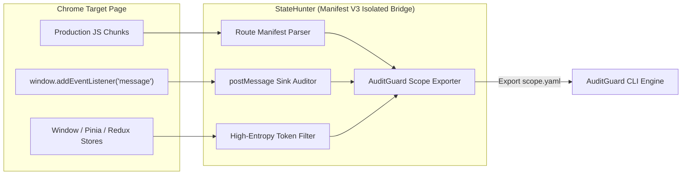

# RFC-001: Community Peer Review — Client-Side Route De-Obfuscation & DOM Sink Auditing

- **RFC Identifier**: `RFC-001`
- **Title**: Architectural Peer Review for StateHunter Client-Side State Inspection & PostMessage Auditing
- **Author**: Joshua A. Wortz, CISSP (Code and Cypher)
- **Status**: Open for Community Review
- **Created**: 2026-09-12
- **Related Technical Paper**: [Bridging the Browser-to-Boundary Gap: From Client-Side SPA State Reconnaissance to Safe Harbor Verification](https://codeandcypher.com/posts/client-side-spa-recon-and-safe-harbor-verification/)
- **Companion Project**: [AuditGuard (Terminal Scope & Verification Engine)](https://github.com/SixFiveMil/auditguard)

---

## 1. Executive Summary

**StateHunter** is an open-source, Manifest V3 Chrome DevTools extension designed for application security engineers, penetration testers, and bug bounty researchers assessing modern Single-Page Applications (Next.js, React, Remix, Vue 3, Pinia, Angular).

Unlike conventional network proxies that only capture traffic over the wire, StateHunter runs directly within Chrome DevTools to inspect client-side JavaScript execution in real time: de-obfuscating unlinked route manifests, auditing dangerous `window.postMessage` listeners, and extracting in-memory state tokens.

With the release of StateHunter v1.0.0, we invite the web security and browser engineering communities to peer-review our architecture, test edge cases in production JavaScript bundlers, and contribute AST parsing enhancements.

---

## 2. Core Technical Components Under Review

### Pillar A: Production JavaScript Chunk Route De-Obfuscation
- **Mechanism**: Scans loaded scripts for dynamic client-side router configurations (Next.js App Router/Pages Router, React Router, Vue Router) and compiled API contracts (Axios/Fetch URL strings) to reveal routes that have no navigational links in the current UI.
- **Review Question 1.1**: What tree-shaking patterns or identifier mangling techniques in Vite, Turbopack, or Webpack bundles present the highest risk of false negatives?
- **Review Question 1.2**: How can we safely parse dynamic template literal route constructions (e.g. `` `/api/v1/${tenant}/${resource}` ``) without executing untrusted client-side code?

### Pillar B: Runtime `postMessage` Listener & DOM Sink Auditing
- **Mechanism**: Non-destructively instruments `window.addEventListener('message')` to detect missing `event.origin` validation and trace data flow into dangerous sinks (`eval`, `element.innerHTML`, `document.write`).
- **Review Question 2.1**: How can we improve iframe cross-origin frame hierarchy detection when multiple nested sandboxed frames communicate across origins?

### Pillar C: Manifest V3 Isolated World Bridge
- **Mechanism**: StateHunter executes its DevTools panel within Chrome's isolated world architecture, strictly adhering to Manifest V3 security requirements without injecting external scripts into the host DOM.
- **Review Question 3.1**: Are there performance bottlenecks or memory retention concerns during continuous deep memory traversal on high-throughput enterprise SPAs?

---

## 3. How to Submit Feedback & Contribute

We actively welcome technical critiques, bug reports, and route parsing test fixtures:

1. **GitHub Issues**: Submit test cases or feature requests at [github.com/SixFiveMil/statehunter/issues](https://github.com/SixFiveMil/statehunter/issues).
2. **GitHub Discussions**: Share feedback in our [RFC-001 Discussion Thread](https://github.com/SixFiveMil/statehunter/discussions).
3. **Pull Requests**: Submit improvements to the de-obfuscation patterns in `src/` directly to `main`.
4. **Community Discussion**: Join the conversation on Reddit (`r/netsec`, `r/bugbounty`) or Hacker News.

---
*StateHunter is 100% free, open-source under the MIT License, and transmits zero telemetry.*
